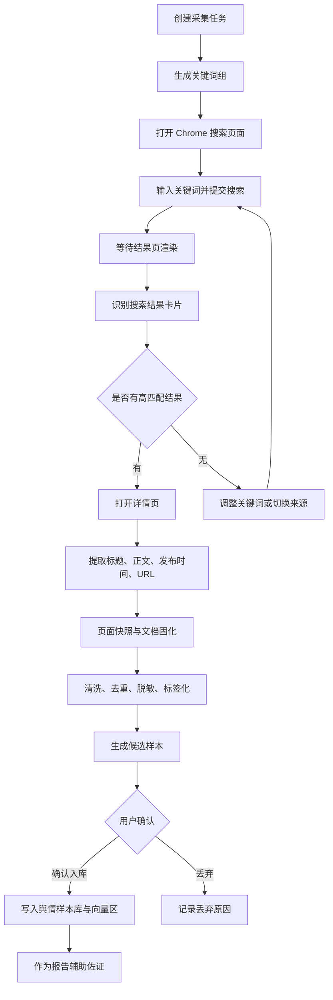

# Chrome 定向舆情采集 PRD 与流程设计

日期：2026-07-24

## 1. 功能定位

在“舆情与调研”模块中新增“Chrome 定向采集”能力，用可见的浏览器自动化动作完成公开网络舆情采集：根据标准条款、待验证文本或人工输入主题生成关键词，打开搜索页面，识别结果，点击匹配链接，抓取详情页正文，形成可复核的舆情样本候选。

本功能服务于标准验证报告中的“群众感知佐证（辅助依据）”。报告主结论仍以现有标准知识库、法律法规、国家标准、行业标准和地方细则的条款级比对为核心依据，舆情只用于说明现实执行感知、群众关注点、问题影响面和专家复核优先级。

## 2. 背景与现状问题

当前系统已有“舆情与调研样本”页面、样本向量区、文件导入、接口同步、公开 URL 采集和报告辅助佐证能力。但现有公开采集主要是服务端直接请求维护 URL，再从静态 HTML 中解析标题、链接和正文片段。

这种方式在以下场景中容易失败：

1. 搜索引擎结果页需要输入关键词、等待渲染、翻页或点击结果，服务端静态请求无法完成真实检索动作。
2. 很多政务、新闻、问政页面正文由 JavaScript 渲染，直接 fetch 只能拿到空壳 HTML。
3. 搜索结果链接可能经过跳转、反爬、重定向或动态加载，现有采集无法稳定拿到最终详情页。
4. 当前“查看”更像查看搜索来源或快照，不等同于“已检索、已打开、已下载/固化后的文档内容查看”。
5. 缺少“候选样本确认”环节，采集结果质量、相关性、敏感信息处理和是否入库需要人工可控。

## 3. 建设目标

1. 将公开网络采集从“后台请求 URL”升级为“浏览器任务流”：输入关键词、打开搜索页、识别结果、点击详情页、抓取正文、固化证据。
2. 采集过程在页面中可观察：用户能看到当前正在搜索哪个关键词、打开哪个页面、抓到了多少候选、失败原因是什么。
3. 形成“采集候选区”，候选样本经用户确认后再进入舆情样本库和向量区。
4. 对每条样本保留来源 URL、搜索关键词、搜索结果标题、详情页标题、发布时间、采集时间、正文摘要、页面快照、下载/固化文档和证据链。
5. 支持按标准条款或待验证文本切片生成定向关键词，使采集结果能回连到具体条款或验证点。
6. 采集失败时给出可处理状态，例如需要登录、验证码、页面禁止访问、正文为空、重复样本、敏感信息待脱敏。

## 4. 非目标

1. 不把舆情样本作为合规结论的主依据。
2. 不采集非公开页面、登录后个人数据、个人隐私、身份证号、手机号等敏感信息。
3. 不绕过网站安全校验，不破解验证码，不规避网站访问限制。
4. 不取消现有文件导入、接口同步和服务端 URL 采集能力。
5. 本 PRD 阶段不进入代码开发，待用户确认后再拆分实现计划。

## 5. 方案对比与推荐

### 方案 A：保留现有服务端 URL 采集

优点：实现成本低，适合固定静态网页，运行速度快，不依赖浏览器状态。

不足：不能真实执行搜索动作，不能稳定处理动态页面、跳转详情页和搜索结果筛选。

适用：作为兜底方式，用于政府公告、静态新闻详情页、已知 URL 的快速采集。

### 方案 B：Chrome 定向采集

优点：更接近人工检索流程，能输入关键词、等待页面渲染、识别搜索结果、点击详情页、读取可见正文，适合“按关键词找对应文字和链接”的场景。

不足：执行时间更长，受验证码、登录、页面结构变化影响，需要任务状态和异常处理。

适用：作为主采集方式，用于搜索引擎、问政平台、新闻站点、政务留言、公开论坛页面等定向舆情采集。

### 方案 C：人工导入与批量解析

优点：最稳定、最可控，适合已下载的 Word、PDF、网页导出、问卷访谈和内部调研材料。

不足：不能自动发现新舆情，需要人工准备材料。

适用：作为保底方式，用于浏览器采集失败、网站访问受限、需要人工确认来源的场景。

### 推荐结论

采用混合方案：Chrome 定向采集作为主路径，服务端 URL 采集作为静态页面兜底，人工导入作为最后保底。所有路径最终统一进入“采集候选区”，经确认后入库，保持证据链和报告引用规则一致。

## 6. 用户流程

1. 用户进入“舆情与调研”页面，选择“Chrome 定向采集”。
2. 用户输入采集主题，也可以从待验证文本切片或标准条款中选择验证点生成关键词。
3. 系统展示关键词组，用户可增删关键词、限定地域、来源类型和时间范围。
4. 用户点击“开始定向采集”。
5. 系统调用 Chrome 打开搜索页面，输入关键词并执行搜索。
6. 系统读取搜索结果页，识别标题、摘要、链接、来源、发布时间线索和关键词命中情况。
7. 系统按相关性排序，自动点击高匹配结果，也允许用户手动选择要打开的结果。
8. 系统进入详情页，等待页面渲染，提取标题、正文、发布时间、来源、页面 URL 和可见正文截图/快照。
9. 系统清洗正文，去重，脱敏，标注问题标签、关联条款和置信度。
10. 结果进入“候选样本区”，用户查看详情、快照和证据链后选择“确认入库”或“丢弃”。
11. 已确认样本进入舆情样本库和向量区，每 20 条分页查看，后续在验证报告中作为辅助佐证。

## 7. 系统流程设计



## 8. 采集任务状态

每个 Chrome 定向采集任务使用可恢复状态，便于页面显示和异常处理。

1. `draft`：已创建任务，尚未启动。
2. `keyword_ready`：关键词已生成，等待用户确认或启动。
3. `searching`：Chrome 正在执行搜索。
4. `scanning_results`：正在读取搜索结果页。
5. `opening_detail`：正在打开候选详情页。
6. `extracting_content`：正在提取正文和元数据。
7. `capturing_snapshot`：正在固化页面快照或文档。
8. `review_required`：候选样本已生成，等待人工确认。
9. `imported`：已确认入库。
10. `partial_failed`：部分来源失败，但已有候选结果。
11. `failed`：任务失败，需要调整关键词、来源或改用人工导入。

## 9. 页面设计

### 9.1 入口位置

在“舆情与调研”页面的“样本接入中心”中，将现有“数据检索引擎”升级为分段入口：

1. `Chrome 定向采集`：默认入口，用于按关键词真实打开网页采集。
2. `URL 快速采集`：保留现有服务端 URL 采集，适合固定静态网页。
3. `文件/表格导入`：保留现有批量导入能力。
4. `接口同步`：保留热线、问政、问卷等平台样本同步。

### 9.2 Chrome 定向采集面板

面板包含以下区域：

1. 采集主题：输入框，支持从待验证文本切片、标准条款、当前验证点一键带入。
2. 关键词组：展示系统生成的关键词，支持手动编辑、删除、添加。
3. 来源范围：搜索引擎、政府网站、地方问政、新闻公开页、社交媒体公开页。
4. 地域与时间：地域默认临平区/杭州市，时间可选近 1 月、近 3 月、近 1 年、不限。
5. 采集深度：每个关键词打开结果数量，默认前 5 条；最大建议 20 条。
6. 启动按钮：开始定向采集、暂停、继续、停止。

### 9.3 采集进度区

进度区使用进度条和动作日志并列展示：

1. 总进度：关键词完成数、搜索结果扫描数、详情页打开数、候选样本数。
2. 当前动作：例如“正在搜索：临平 办事 材料 重复提交”。
3. 浏览器动作日志：打开搜索页、输入关键词、点击第 N 条结果、提取正文、生成快照。
4. 异常提示：验证码、登录限制、页面空白、正文抽取失败、重复样本。

### 9.4 搜索结果候选区

每条搜索结果展示：

1. 结果标题。
2. 来源站点。
3. 摘要命中片段。
4. URL。
5. 关键词命中数。
6. 相关性评分。
7. 操作：打开、跳过、加入采集队列。

### 9.5 详情页候选样本区

每条已打开详情页展示：

1. 页面标题。
2. 正文摘要。
3. 发布时间。
4. 采集时间。
5. 来源 URL。
6. 关联关键词。
7. 关联条款或待验证切片。
8. 问题标签。
9. 脱敏状态。
10. 证据链。
11. 操作：查看固化文档、查看页面快照、确认入库、丢弃。

### 9.6 查看按钮规则

“查看”按钮查看的是系统已经打开、抓取、固化后的页面文档，而不是直接打开搜索引擎结果。

建议按钮拆分为：

1. `查看固化文档`：打开系统保存的 HTML/PDF/正文文档快照。
2. `查看原网页`：打开原始来源 URL，用于人工复核。
3. `查看证据链`：展示搜索关键词、结果页、详情页、采集时间、抽取状态。

## 10. 数据结构设计

### 10.1 DirectedSignalCollectionTask

```ts
type DirectedSignalCollectionTask = {
  id: string;
  topic: string;
  region: string;
  sourceScope: string[];
  timeRange: string;
  keywords: string[];
  status: string;
  progress: {
    keywordTotal: number;
    keywordDone: number;
    resultScanned: number;
    detailOpened: number;
    candidates: number;
  };
  createdAt: string;
  startedAt?: string;
  finishedAt?: string;
  logs: BrowserActionLog[];
};
```

### 10.2 BrowserActionLog

```ts
type BrowserActionLog = {
  at: string;
  action: "open_search" | "type_keyword" | "scan_results" | "open_detail" | "extract_content" | "capture_snapshot" | "error";
  label: string;
  detail: string;
  url?: string;
};
```

### 10.3 SearchResultCandidate

```ts
type SearchResultCandidate = {
  id: string;
  taskId: string;
  keyword: string;
  title: string;
  snippet: string;
  url: string;
  sourceName: string;
  rank: number;
  relevanceScore: number;
  matchedTerms: string[];
  status: "pending" | "queued" | "opened" | "skipped" | "failed";
};
```

### 10.4 CapturedPublicSignalPage

```ts
type CapturedPublicSignalPage = {
  id: string;
  taskId: string;
  resultId: string;
  sourceUrl: string;
  finalUrl: string;
  pageTitle: string;
  publishedAt?: string;
  capturedAt: string;
  rawText: string;
  cleanText: string;
  snapshotUrl: string;
  fixedDocumentUrl: string;
  screenshotUrl?: string;
  extractionStatus: "success" | "empty" | "partial" | "blocked" | "failed";
};
```

### 10.5 SignalImportCandidate

```ts
type SignalImportCandidate = {
  id: string;
  capturedPageId: string;
  source: string;
  region: string;
  type: string;
  text: string;
  evaluationText?: string;
  matchedClauseId?: string;
  matchedClauseSource?: string;
  issueTags: string[];
  confidence: number;
  confidenceParts: {
    relevance: number;
    completeness: number;
    comparability: number;
    dataQuality: number;
  };
  reviewStatus: "pending" | "approved" | "rejected" | "needs_edit";
  evidenceStatus: "real_collected";
  evidenceChain: EvidenceChainItem[];
};
```

## 11. 正文抽取规则

1. 优先读取页面主体区域，例如 `article`、`main`、政务正文容器、新闻正文容器。
2. 排除导航、页脚、广告、相关推荐、评论区无关内容。
3. 如果正文为空，回退读取页面可见文本中与关键词命中的片段。
4. 如果仍为空，标记为 `empty`，不自动入库。
5. 正文长度过短、乱码比例高、关键词命中不足时，标记为需要人工复核。
6. 对身份证号、手机号、邮箱、具体住址、姓名等个人信息做脱敏处理。
7. 保留原始正文和清洗正文的区分，页面展示默认使用清洗正文。

## 12. 证据链规则

每条候选样本至少保留以下证据链：

1. 任务创建：主题、地域、来源范围、关键词。
2. 搜索执行：搜索页面、关键词、搜索时间。
3. 结果命中：结果标题、摘要、排名、URL、命中词。
4. 详情打开：最终 URL、页面标题、打开时间。
5. 正文抽取：抽取方法、文本长度、质量状态。
6. 快照固化：固化文档地址、快照地址、采集时间。
7. 人工确认：确认人、确认时间、入库或丢弃原因。

## 13. 与验证报告的关系

1. 舆情样本进入报告时只出现在“群众感知佐证（辅助依据）”章节。
2. 报告主判断仍来自标准知识库比对，不因舆情数量多而自动改变合规结论。
3. 舆情内容用于表达“群众反馈集中在某办理环节”“该条款存在现实执行关注点”“建议提高专家复核优先级”等。
4. 报告中必须展示样本来源数量、代表性摘要、证据边界和可信度提示。
5. 如样本未通过人工确认，不进入正式报告。

## 14. 异常与风控

1. 验证码：暂停任务，提示用户人工处理或跳过该来源。
2. 登录限制：不采集，标记为受限来源。
3. 页面禁止访问：记录 HTTP/页面错误，允许改用 URL 快速采集或人工导入。
4. 正文为空：保留搜索结果候选，不进入样本库。
5. 重复样本：按最终 URL、标题和正文相似度去重。
6. 敏感信息：自动脱敏，脱敏前内容不进入报告展示。
7. 网站结构变化：记录抽取失败原因，并允许手动选择页面正文区域作为后续增强方向。
8. 来源可信度不足：标记低可信，不参与报告摘要优先展示。

## 15. 分阶段实施建议

### 阶段一：任务流与候选样本闭环

目标是先把 Chrome 定向采集主流程跑通。包括关键词生成、打开搜索页、识别结果、点击详情页、抽取正文、固化快照、候选确认和入库。

验收重点：用户能看到真实浏览器动作日志，查看按钮能打开系统固化后的文档内容，确认后的样本能进入舆情样本库。

### 阶段二：条款关联与质量评分

目标是把候选样本和待验证文本切片、标准条款、问题标签关联起来。增加相关性、完整性、可比对性和数据质量评分。

验收重点：样本能回连具体条款或验证点，低质量样本不会自动进入报告。

### 阶段三：报告辅助佐证增强

目标是在验证报告中稳定引用已确认样本，形成“群众感知佐证”章节，并明确辅助依据边界。

验收重点：报告主结论仍以标准知识库比对为主，舆情只补充现实关注点和复核建议。

## 16. 验收标准

1. 用户可以从“舆情与调研”页面启动 Chrome 定向采集任务。
2. 系统可以按关键词打开搜索页面并读取搜索结果。
3. 系统可以点击搜索结果进入详情页并抽取正文。
4. 每条候选样本具备来源 URL、标题、发布时间或采集时间、正文摘要、快照/固化文档和证据链。
5. “查看固化文档”打开的是系统采集后保存的文档，不是搜索结果页。
6. 候选样本必须经过用户确认后才能入库。
7. 已确认样本进入舆情样本库和向量区，并保留每 20 条分页查看。
8. 采集失败时页面展示明确原因和下一步建议。
9. 报告中舆情部分标注为辅助依据，不覆盖标准知识库比对结论。
10. 不采集非公开页面，不绕过验证码和登录限制，不展示未脱敏敏感信息。

## 17. 自检结论

本设计聚焦在 Chrome 定向舆情采集一个独立能力上，边界清晰：采集结果先进入候选区，确认后入库，报告中仅作辅助佐证。现有服务端 URL 采集、文件导入、接口同步均保留，降低改造风险。页面“查看”按钮的含义已明确为查看固化文档，能够回应当前“查看为空”和“不是查看搜索结果”的问题。
